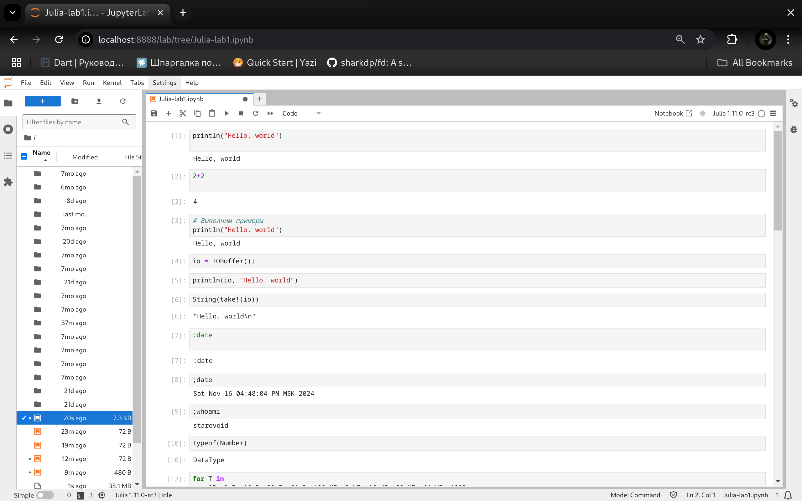

# Лабораторная работа №1

# Выполнил Старовойтов Егор Сергеевич, НПИбд-02-21

# Цель работы
Основная цель работы — подготовить рабочее пространство и инструментарий для
работы с языком программирования Julia, на простейших примерах познакомиться
с основами синтаксиса Julia.

# Задание
Здесь приводится описание задания в соответствии с рекомендациями
методического пособия и выданным вариантом.

1. Установите под свою операционную систему Julia, Jupyter.
2. Используя Jupyter Lab, повторите примеры из раздела.
3. Выполните задания для самостоятельной работы.

# Выполнение лабораторной работы
## 1. Установка julia и jupyter notebook

## 2. Примеры кода и самостоятельное задание

# Выводы
Я подготовил рабочее пространство и инструментарий для
работы с языком программирования Julia, на простейших примерах познакомился
с основами синтаксиса Julia.

