---
## Front matter
lang: ru-RU
title: "Лабораторная работа № 2"
subtitle: "Структуры данных"
author:
  - Старовойтов Е. С.
institute:
  - Российский университет дружбы народов, Москва, Россия
date: 21 ноября 2024

## i18n babel
babel-lang: russian
babel-otherlangs: english

## Formatting pdf
toc: false
toc-title: Содержание
slide_level: 2
aspectratio: 169
section-titles: true
theme: metropolis
header-includes:
 - \metroset{progressbar=frametitle,sectionpage=progressbar,numbering=fraction}
---

# Информация

## Докладчик

  * Старовойтов Егор Сергеевич 
  * студент кафедры ТВиК
  * Российский университет дружбы народов
  * [1032212281@pfur.ru](mailto:1032212281@pfur.ru)

# Вводная часть

## Цели и задачи
Основная цель работы — изучить несколько структур данных, реализованных в Julia,
научиться применять их и операции над ними для решения задач.

1. Используя Jupyter Lab, повторите примеры из раздела 2.2.
2. Выполните задания для самостоятельной работы (раздел 2.4)

## Результаты
Поставленные боевые задачи были выполнены, все цели достигнуты.

# Выполнение лабораторной работы
## Задание 1
Были повторены все примеры.

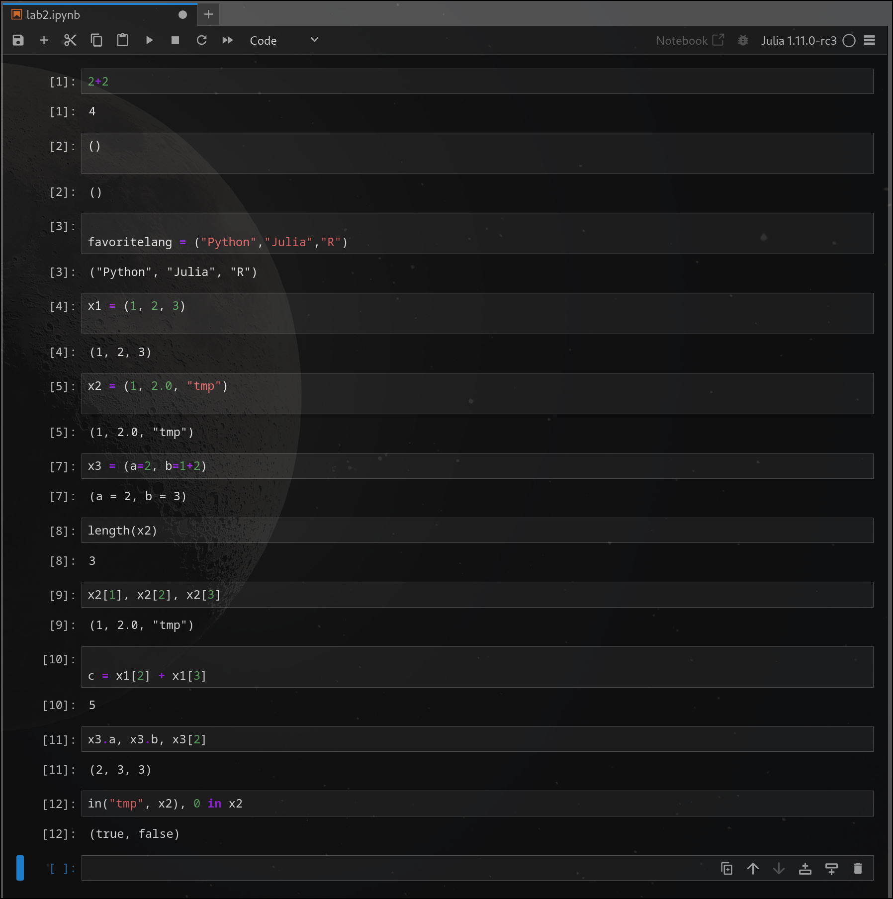

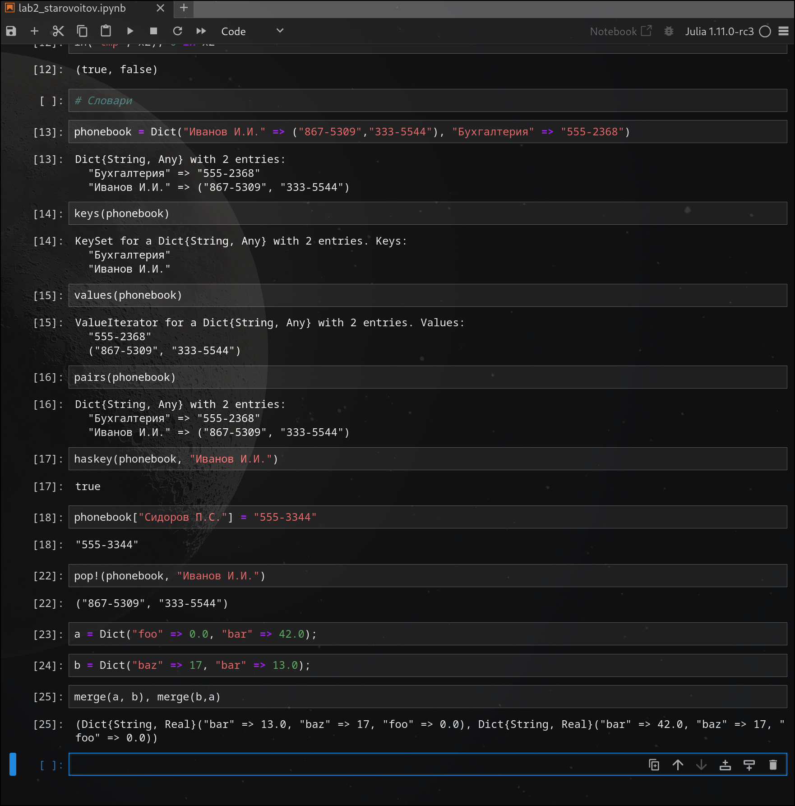

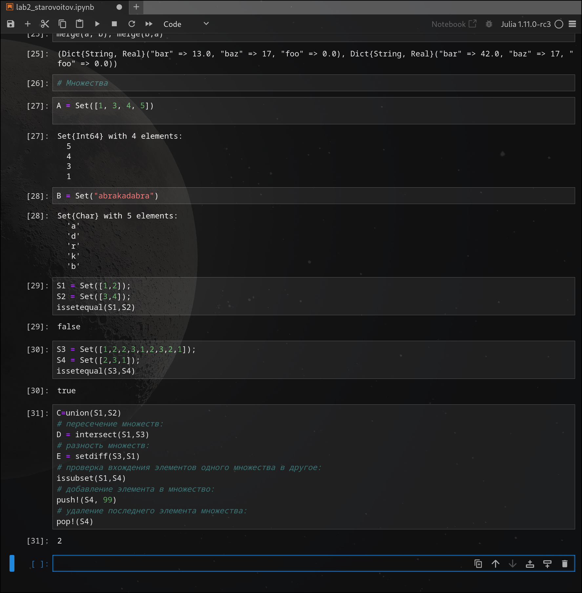

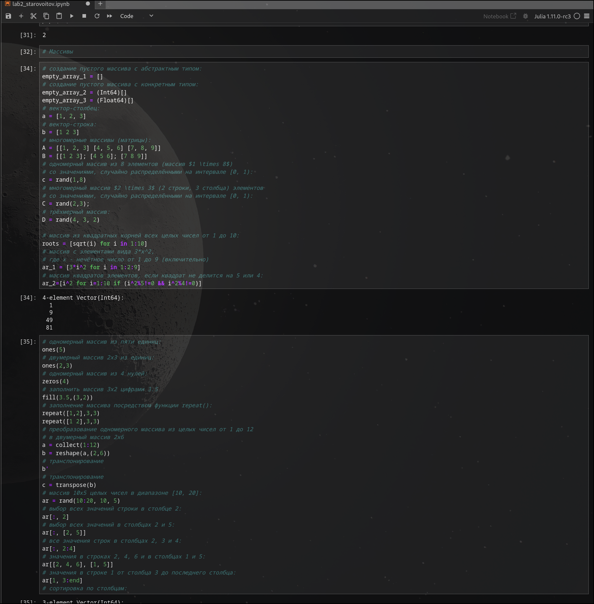

## Задание 2 - самостоятельная работа
### Задачи 1 и 2
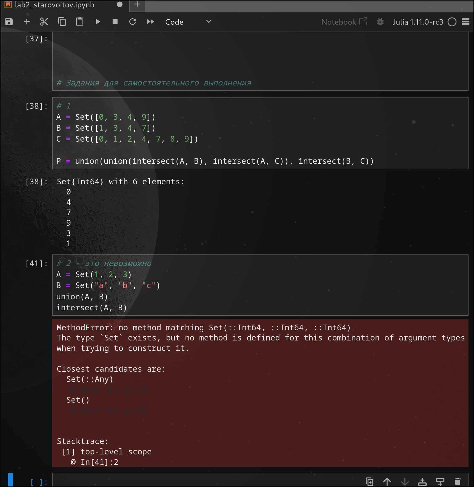

### Задача 3
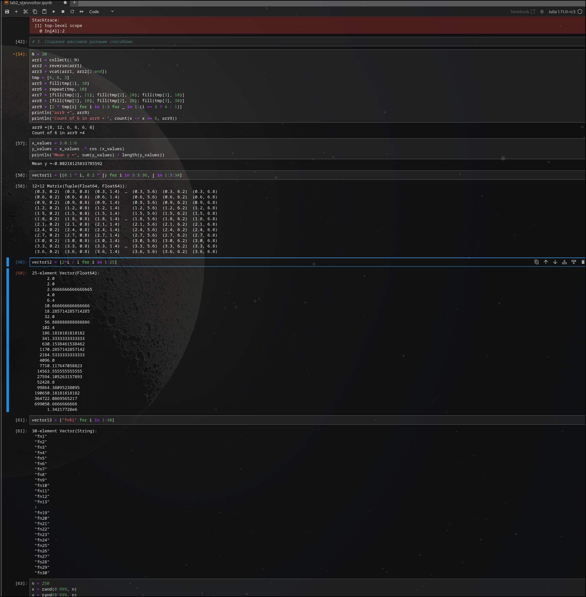

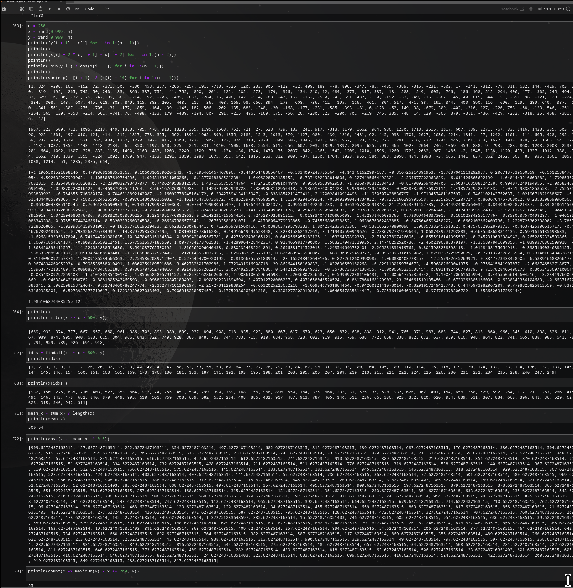

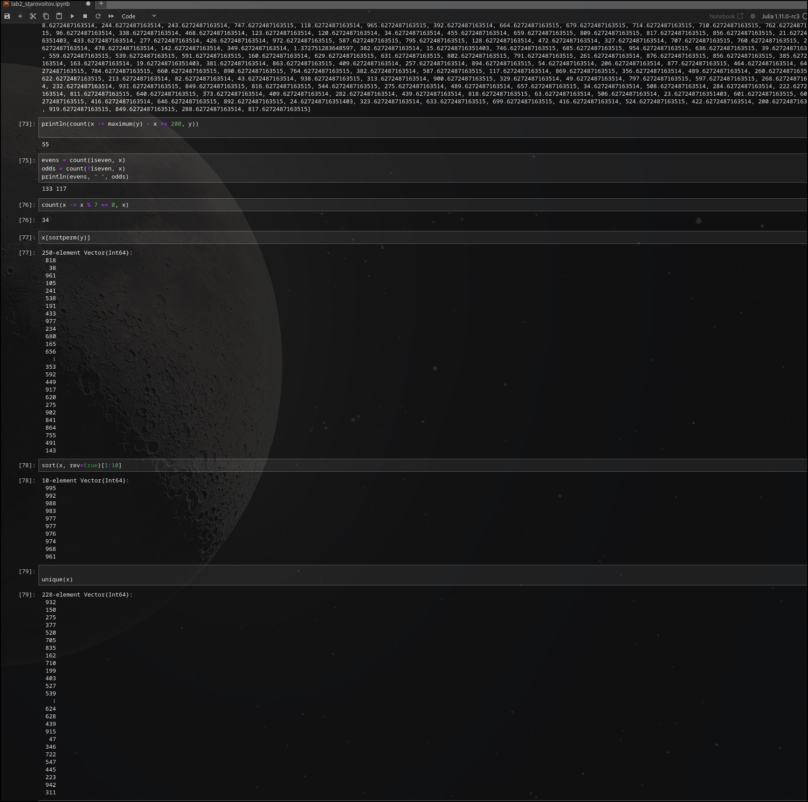

### Задача 4
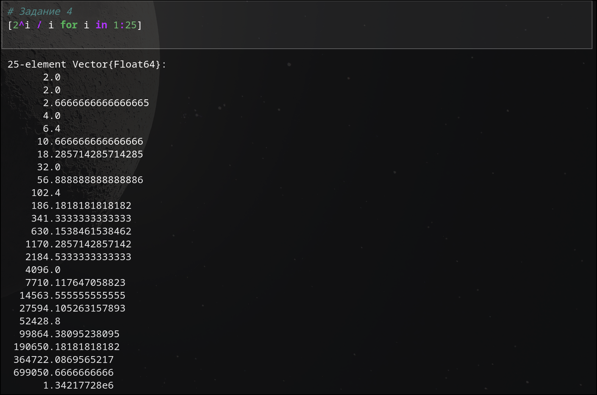

### Задача 5
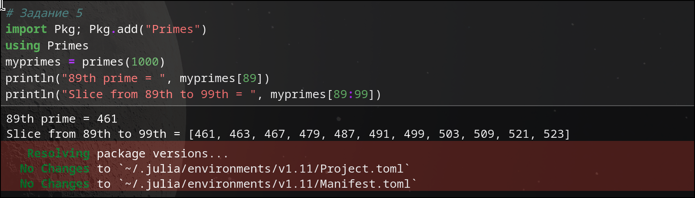

### Задача 6
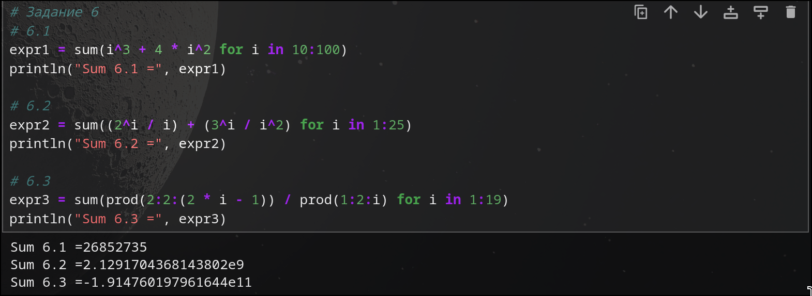

# Выводы
Я изучил несколько структур данных, реализованных в Julia,
научился применять их и операции над ними для решения задач, выполнив все предложенные задания.

# Список литературы{.unnumbered}

