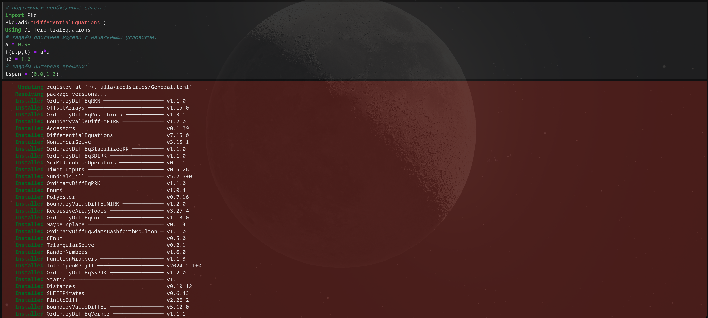
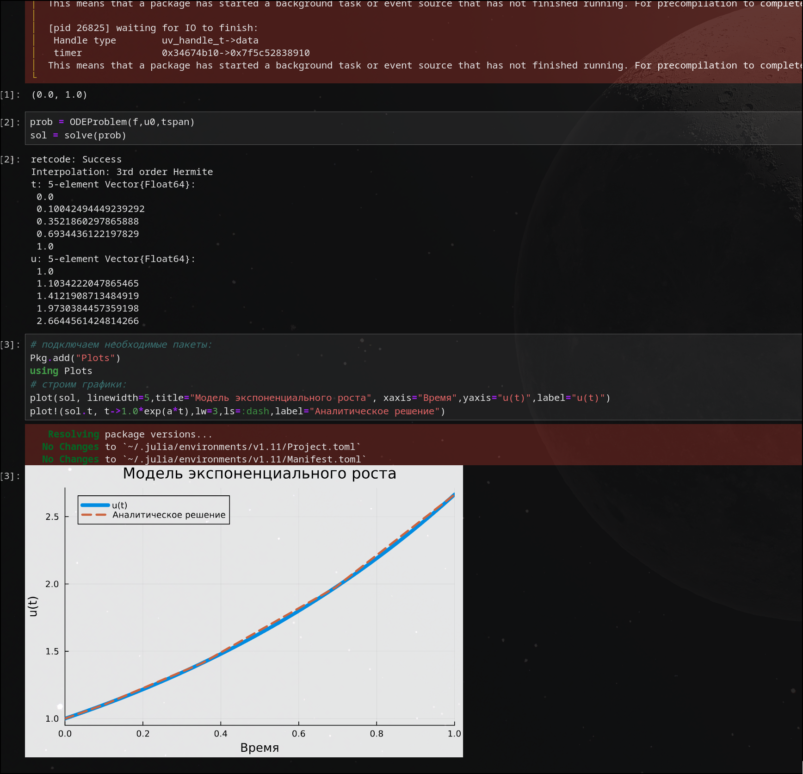
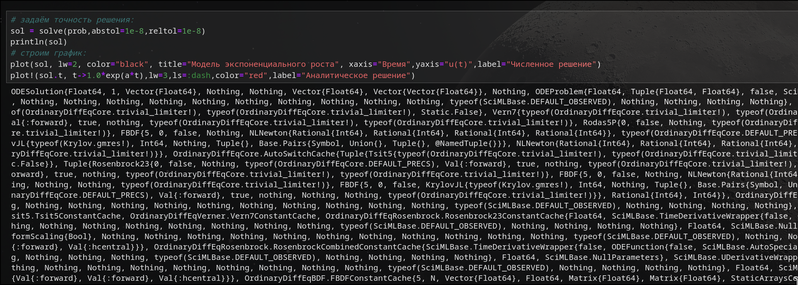
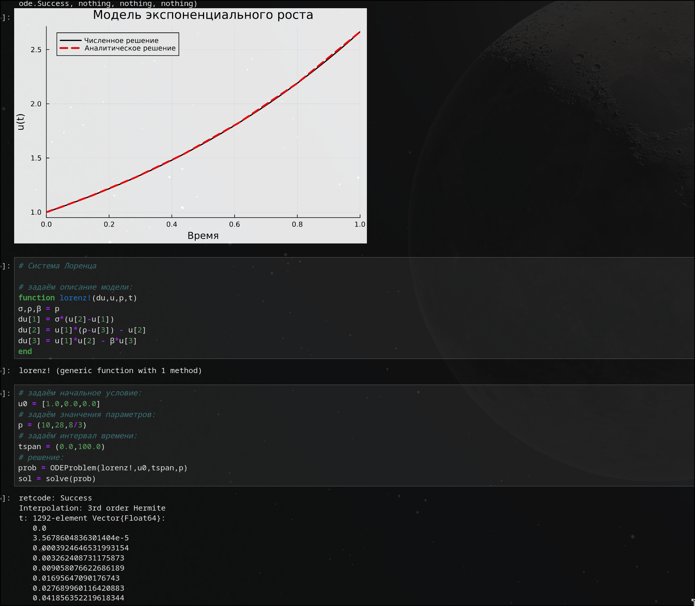
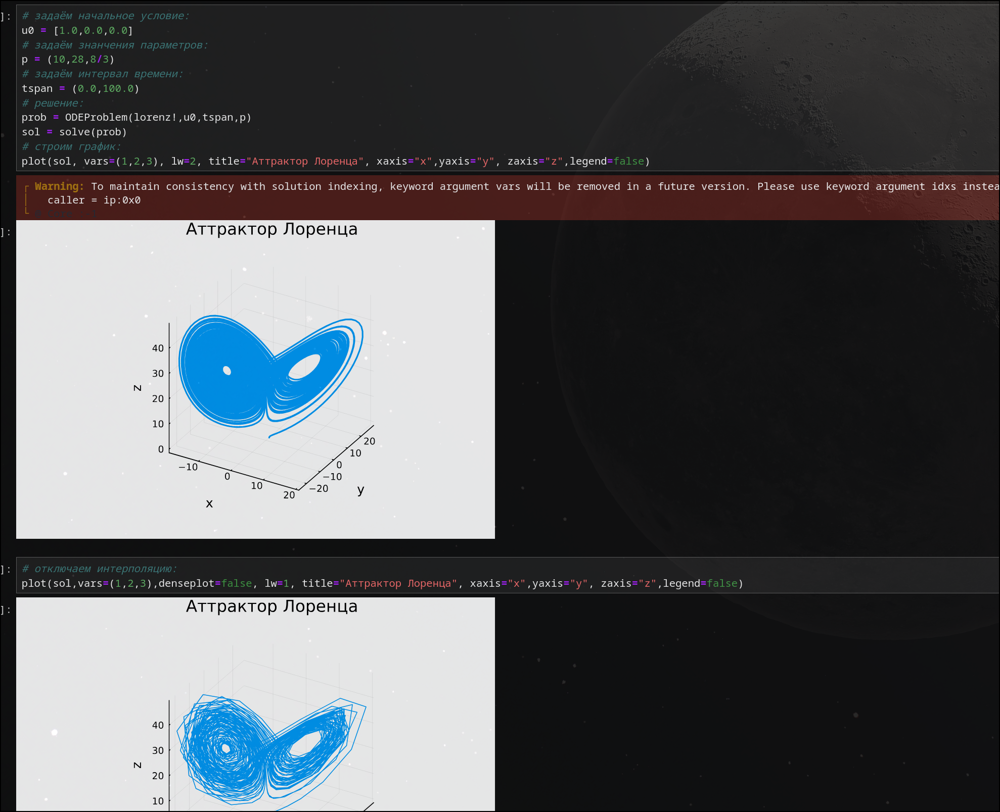
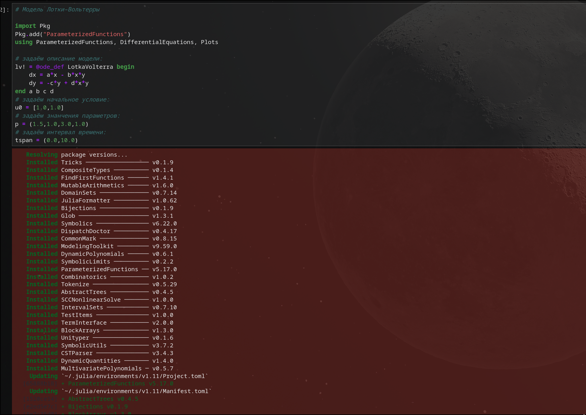
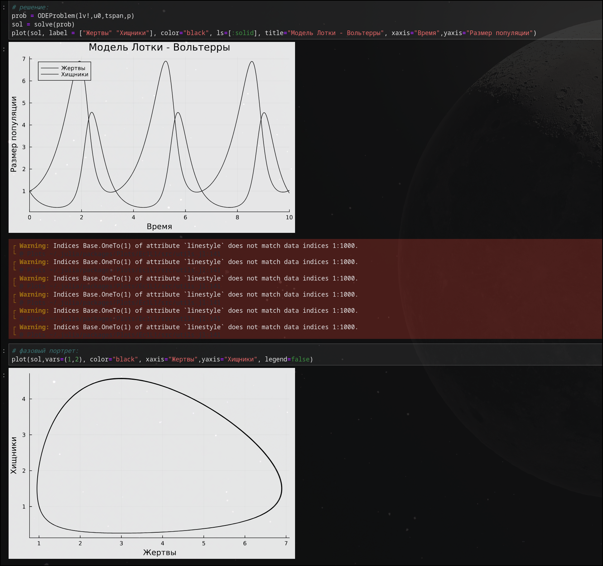

---
## Front matter
lang: ru-RU
title: "Лабораторная работа № 6"
subtitle: "Решение моделей в непрерывном и дискретном времени"
author:
  - Старовойтов Е. С.
institute:
  - Российский университет дружбы народов, Москва, Россия
date: 19 декабря 2024

## i18n babel
babel-lang: russian
babel-otherlangs: english

## Formatting pdf
toc: false
toc-title: Содержание
slide_level: 2
aspectratio: 169
section-titles: true
theme: metropolis
header-includes:
 - \metroset{progressbar=frametitle,sectionpage=progressbar,numbering=fraction}
---

# Информация

## Докладчик

  * Старовойтов Егор Сергеевич 
  * студент кафедры ТВиК
  * Российский университет дружбы народов
  * [1032212281@pfur.ru](mailto:1032212281@pfur.ru)

# Вводная часть

## Цели и задачи
Основной целью работы является освоение специализированных пакетов для решения
задач в непрерывном и дискретном времени.

# Задание
1. Используя Jupyter Lab, повторите примеры из раздела 6.2. 
2. Выполните задания для самостоятельной работы (раздел 6.4)

## Результаты
Поставленные боевые задачи были выполнены, все цели достигнуты.

# Выполнение лабораторной работы

# Выводы
Я освоил специализированные пакеты для решения
задач в непрерывном и дискретном времени.

# Список литературы{.unnumbered}

